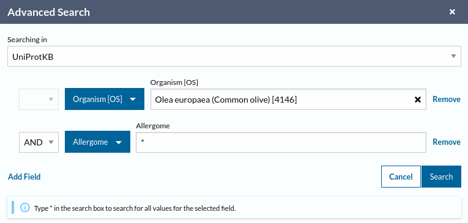

# AllergenDetectR

R workflow to detect new pollen allergens

***

## Table of contents

* [Prerequisites](#prerequisites)
* [Installation](#installation)
* [Components](#components)
* [Configuration](#configuration)
* [Input files](#input-files)
* [Output files](#output-files)
* [Citation](#citation)
* [License](#license)

***

## Prerequisites

Previous to the execution of this script, you need to download the two databases needed:

1. _Study organism allergens DB_: All the study organism protein sequences available in [UniProt](https://www.uniprot.org/) that have at least one cross reference to the [Allergome](https://www.uniprot.org/) database.
	1. Go to <https://www.uniprot.org/>.
	1. In the search toolbar select "Advanced".
	1. Fill the form:
	
	1. Download the FASTA file with the protein sequences.
1. _Non-study organism allergens DB_.
	1. Go to <https://www.uniprot.org/>.
	1. In the search toolbar select "Advanced".
	1. Fill the form:
	
	1. Download the FASTA file with the protein sequences.
1. You will also need to download DIAMOND software following the GitHub instructions: <https://github.com/bbuchfink/diamond/wiki>.

***

## Installation

You will need a local copy of the GitHub _AllergenDetectR_ repository on your machine. It can be done using git in the shell:

```bash
git clone git@github.com:bullones/AllergenDetectR.git
```

Alternatively, you can go to <https://github.com/bullones/AllergenDetectR/> and click on _Code_ button and then _Clone_, or select _Download ZIP_ or any other possibility you prefer. The cloned of unzipped directory `AllergenDetectR` should be placed somewhere on your `$HOME` in Linux, macOS and Windows.

Then you can navigate inside _AllergenDetectR_ using shell comands or window interface.

***

## Components

***

## Configuration

***

## Input files

***

## Output files

Each execution of

***

## Citation

Please, reference this pipeline and its documentation as follows:

***

## License


[CC-BY](https://creativecommons.org/licenses/by/4.0/)

**Authors**: Amanda Bullones, M. Gonzalo Claros and Rosario Carmona

Any concern, suggestion, bug or whatelse can be addressed to [Amanda Bullones](mailto:amandabullones@uma.es)
