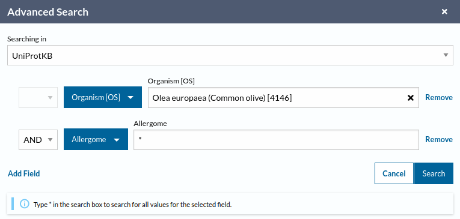

```{r setup, include=FALSE}
knitr::opts_chunk$set(echo = TRUE)
``` 

# First step

Previous to the execution of this script, you need to download the two databases needed:

1. <i>Olive allergens DB</i>: All the <i>Olea europaea</i> protein sequences available in [UniProt](https://www.uniprot.org/) that has at least one cross reference to the [Allergome](https://www.uniprot.org/) database.
    1. Go to <https://www.uniprot.org/>.
    1. In the search toolbar select "Advanced".
    1. Fill the form:

    1. Download the FASTA file with the protein sequences. At the moment of writing this protocol (March 5, 2024), there were 74 reviewed and 35 unreviewed for a total of 109 proteins corresponding to the 15 olive allergens identified to date.

1. <i>Non-olive allergens DB</i>.
    1. Go to <https://www.uniprot.org/>.
    1. In the search toolbar select "Advanced".
    1. Fill the form:

    1. Download the FASTA file with the protein sequences. At the moment of writing this protocol (March 5, 2024), there were 1,236 reviewed and 3,062 unreviewed for a total of 4,298 proteins corresponding to allergens described in other species.
    
You will also need to download DIAMOND software following the GitHub instructions: <https://github.com/bbuchfink/diamond>.

```{r variables, include=FALSE}
# percentage of identical positions threshold used to detect new allergens
p_ident=40
# percentage of alignment threshold used to detect new allergens
p_align=40
# percentage of identical position threshold used to discard the olive known allergens
oleur_ident=80
# percentage of alignment threshold used to discard the olive known allergens
oleur_align=80
# percentage of identical position threshold used to detect distant isoforms
iso_ident=60
# percentage of alignment threshold used to detect distant isoforms
iso_align=60
#maximum e-value to report alignments
evalue=1e-1
# maximum number of target sequences to report alignments for
# BLAST default is 100
# maxtarg=10
maxtarg=100
# choose the sensitivity mode for DIAMOND
## options:
## sens_mode="--fast" # runs faster and finds hits of >90% identity
## sens_mode="--mid-sensitive"
## sens_mode="--sensitive" # full sensitivity for hits >40% identity
## sens_mode="--more-sensitive"
## sens_mode="--very-sensitive" # best sensitivity including the zone of <40% identity
## sens_mode="--ultra-sensitive" # more sensitive
sens_mode="--ultra-sensitive"
```

# Customized variables

```{r, include=FALSE}
if (fasta_type==1) fasta_file <- "proteome"
if (fasta_type==2) fasta_file <- "transcriptome"
```

Variable | Value
:---     | :---
Olive tree allergen DB | `r PATH_SUBJECT_ALLERGEN_OLEUR`
Non-olive tree allergen DB | `r PATH_SUBJECT_ALLERGEN_NO_OLEUR`
Olive pollen `r fasta_file` | `r PATH_TEST_PROTEOME`

# Create new folder to save results

For each run, a new results folder will be created using the date and time of execution. Within the folder, the result files generated in each step will be saved.

```{r}
message("In this execution, the results will be saved in ", RES_DIR)
```

# Load FASTA file

```{r load_fasta}
# load proteome/transcriptome FASTA
if (fasta_type==2){
  myfasta <- readDNAStringSet(PATH_TEST_PROTEOME)
} else if (fasta_type==1){
  myfasta <- readAAStringSet(PATH_TEST_PROTEOME)
} else {
  message("The olive pollen FASTA file couldn't be read")
}
# change FASTA IDs to remove annotations
names(myfasta) <- gsub(" .*", "", names(myfasta))
num_ini <- length(names(myfasta)) # proteins/transcripts of the reference for final table
message(paste0("Your ", fasta_file, " contains ", num_ini, " IDs"))
```

```{r result_files, include=FALSE}
# names for the results files
allergens_sp_db = "allergens_olea_db"
allergens_no_sp_db = "allergens_no_olea_db"
diamond_oleex = "diamond_oleex.tsv"
diamond_oleex_filtered = "diamond_oleex_filtered.tsv"
proteins_oleex = "proteins_oleex_ids.txt"
proteins_total = "proteins_total_ids.txt"
proteins_no_oleex = "proteins_no_oleex.txt"
proteome_pollen_no_oleex = "proteome_pollen_no_oleex.fasta"
proteome_pollen_oleex = "proteome_pollen_oleex.fasta"
diamond_allergens = "diamond_allergens.tsv"
diamond_allergens_filtered = "diamond_allergens_filtered.tsv"
diamond_no_oleur = "diamond_no_oleur.tsv"
diamond_no_oleur_filtered = "diamond_no_oleur_filtered.tsv"
proteins_with_allergen = "proteins_with_allergen_ids.txt"
proteome_with_allergens = "proteins_with_allergen.fasta"
diamond_oleur = "diamond_oleur.tsv"
diamond_oleur_filtered = "diamond_oleur_filtered.tsv"
proteome_isoforms = "proteins_isoforms.fasta"
proteome_new = "proteins_new_allergens.fasta"
```

```{r arguments, include=FALSE}
# pass arguments to bash
Sys.setenv(RESULTS = RES_DIR)
Sys.setenv(PATH_DIAMOND = path_diamond)
Sys.setenv(MODE = blast_mode)
Sys.setenv(ALLERGEN_OLEUR = PATH_SUBJECT_ALLERGEN_OLEUR)
Sys.setenv(ALLERGEN_NO_OLEUR = PATH_SUBJECT_ALLERGEN_NO_OLEUR)
Sys.setenv(FASTA_POLLEN = PATH_TEST_PROTEOME)
Sys.setenv(THREADS = threads)
Sys.setenv(EVALUE = evalue)
Sys.setenv(MAXTARG = maxtarg)
Sys.setenv(SENSITIVITY = sens_mode)
Sys.setenv(DIAMOND_OLEEX = diamond_oleex)
Sys.setenv(ALLERGENS_SP_DB = allergens_sp_db)
Sys.setenv(ALLERGENS_NO_SP_DB = allergens_no_sp_db)
Sys.setenv(DIAMOND_OLEEX_FILTERED = diamond_oleex_filtered)
Sys.setenv(PROTEINS_OLEEX = proteins_oleex)
Sys.setenv(PROTEINS_TOTAL = proteins_total)
Sys.setenv(PROTEINS_NO_OLEEX = proteins_no_oleex)
Sys.setenv(PROTEOME_POLLEN_NO_OLEEX = proteome_pollen_no_oleex)
Sys.setenv(PROTEOME_POLLEN_OLEEX = proteome_pollen_oleex)
Sys.setenv(DIAMOND_ALLERGENS = diamond_allergens)
Sys.setenv(DIAMOND_ALLERGENS_FILTERED = diamond_allergens_filtered)
Sys.setenv(DIAMOND_NO_OLEUR = diamond_no_oleur)
Sys.setenv(DIAMOND_NO_OLEUR_FILTERED = diamond_no_oleur_filtered)
Sys.setenv(PROTEINS_WITH_ALLERGEN = proteins_with_allergen)
Sys.setenv(PROTEOME_WITH_ALLERGEN = proteome_with_allergens)
Sys.setenv(DIAMOND_OLEUR = diamond_oleur)
```

```{r functions, include=FALSE}
# Define functions
# i = iteration (mandatory)
# b = Blast result input file to be filtered (mandatory)
# p = Percentage identity threshold (mandatory)
# a = Alignment length threshold for query (optional)
# s = Percentage alignment length threshold for subject (optional)
filter_blast <- function(i,
                         b,
                         p,
                         a = 0,
                         s = 0){
  ## testing function arguments
  # message(paste0("p = ", p))
  # message(paste0("a = ", a))
  # message(paste0("s = ", s))
  if (b$pident[i] >= p && b$length[i] >= a) {
    local_ap <- round((b$length[i]*100/b$slen[i]), digits = 2)
    if (local_ap >= s) {
      tmp <- data.frame(b[i, c(1:12, 18, 17, 19)],
                        localap = local_ap)
      return(tmp)
    } # end if
  } # end if
} # end function
```

# Detect known Oleur allergens (Ole e x)

## Prepare database

We will create the diamond-formatted database needed for DIAMOND execution using *Olive allergens DB* protein FASTA file.

```{bash db}
# create diamond-formatted databases
$PATH_DIAMOND/diamond makedb --in $ALLERGEN_OLEUR --db $RESULTS/$ALLERGENS_SP_DB 2> $RESULTS/diamond.err > $RESULTS/diamond.out
```

## Launch DIAMOND

```{bash blast_oleur}
# running search with Ole e x allergens
$PATH_DIAMOND/diamond $MODE --db $RESULTS/$ALLERGENS_SP_DB --query $FASTA_POLLEN --threads $THREADS --evalue $EVALUE --max-target-seqs $MAXTARG $SENSITIVITY --out $RESULTS/$DIAMOND_OLEEX --outfmt 6 qseqid sseqid pident length mismatch gapopen qstart qend sstart send evalue bitscore score qframe qseq sseq qlen slen stitle --header simple 2>> $RESULTS/diamond.err 1>> $RESULTS/diamond.out
```

## Filter results

We will detect the olive known allergens to discard them from the analyses. To this purpose, we will use DIAMOND `r blast_mode` between the query transcriptome and *Olive allergens DB* with restrictive filters: E-value < `r evalue`, percentage of identical positions ≥ `r oleur_ident`% and percentage of alignment coverage ≥ `r oleur_align`%.

The tentative transcripts (TT) that pass the filter are considered to be known olive tree allergens (TT~known~), while the other are a source of potential new allergens (TT~source~).

```{r filter_blast_oleur}
# load blast results
blast_result <- read.table(file = paste0(RES_DIR, "/", diamond_oleex),
                           header = TRUE,
                           sep = "\t",
                           quote = "")
# filter the results
blast_filtered <- do.call(rbind,
                          lapply(1:nrow(blast_result), # range = i
                                 filter_blast, # function
                                 b = blast_result, # all other variables
                                 p = oleur_ident,
                                 s = oleur_align))
# save the filtering results
file_name <- paste0(RES_DIR, "/", diamond_oleex_filtered)
write.table(blast_filtered,
            file = file_name,
            quote = FALSE,
            sep = "\t",
            row.names = FALSE)
message("DIAMOND filtered results for known Oleur allergens were saved in file ", file_name)
# separate transcripts with/without Ole e x match
ids_oleex <- unique(blast_filtered[, 1])
ids_total <- gsub(" .*", "", names(myfasta))
# keep IDs that are not Ole e x
ids_no_oleex <- ids_total[!(ids_total %in% ids_oleex)]
num_oleex <- length(ids_oleex) # proteins that are Ole e x for final table
num_nooleex <- length(ids_no_oleex) # proteins that are NOT Ole e x for final table
message("Transcripts that are Ole e x: ", num_oleex, "\n",
        "Transcripts that are not Ole e x: ", num_nooleex)
```

## Save Ole e x and not Ole e x proteins

Save not Ole e x proteins.

```{r}
# obtain FASTA file
sub <- myfasta[ids_no_oleex]
# check the FASTA contains all the IDs
tmp <- table(names(sub) %in% ids_no_oleex)
if (!is.na(tmp["FALSE"])) warning(paste0(proteome_pollen_no_oleex, " does not contain all the IDs."))
# save FASTA file
file_name <- paste0(RES_DIR, "/", proteome_pollen_no_oleex)
writeXStringSet(sub, file = file_name)
message("Not Ole e x proteins were saved in file ", file_name)
```

Save Ole e x proteins.

```{r}
# obtain FASTA file
sub <- myfasta[ids_oleex]
# check the FASTA contains all the IDs
tmp <- table(names(sub) %in% ids_oleex)
if (!is.na(tmp["FALSE"])) warning(paste0(proteome_pollen_oleex, " does not contain all the IDs."))
# save FASTA file
file_name <- paste0(RES_DIR, "/", proteome_pollen_oleex)
writeXStringSet(sub, file = file_name)
message("Ole e x allergen proteins were saved in file ", file_name)
```

# Detect cross-reactivity

## Prepare database

We will create the diamond-formatted database needed for DIAMOND execution using *Non-olive allergens DB* protein FASTA file.

```{bash}
$PATH_DIAMOND/diamond makedb --in $ALLERGEN_NO_OLEUR --db $RESULTS/$ALLERGENS_NO_SP_DB 2>> $RESULTS/diamond.err 1>> $RESULTS/diamond.out
```

## Launch DIAMOND

```{bash blast_allergens}
# running search with no Ole e x allergens
$PATH_DIAMOND/diamond $MODE --db $RESULTS/$ALLERGENS_NO_SP_DB --query $RESULTS/$PROTEOME_POLLEN_OLEEX --threads $THREADS --evalue $EVALUE --max-target-seqs $MAXTARG $SENSITIVITY --out $RESULTS/$DIAMOND_ALLERGENS --outfmt 6 qseqid sseqid pident length mismatch gapopen qstart qend sstart send evalue bitscore score qframe qseq sseq qlen slen stitle --header simple 2>> $RESULTS/diamond.err 1>> $RESULTS/diamond.out
```

## Filter results

To obtain information about the cross-reactivity between TT~known~ and allergens from other species, we will use DIAMOND `r blast_mode` to compare them with the *Non-olive allergens DB*.

A cross-reactivity allergen must meet one of the following requirements:

1. Its identity with the complete sequence of the allergenic protein must be ≥ 50%;
1. Or ≥ 35% within a sequence window of 80 amino acids;
1. Or 100% identical within a window of 8 amino acids.

```{r filter_blast_allergens}
# load blast results
blast_result <- read.table(file = paste0(RES_DIR, "/", diamond_allergens),
                           header = TRUE,
                           sep = "\t",
                           quote = "")
# filter the results
blast_filtered_1 <- do.call(rbind,
                            lapply(1:nrow(blast_result), # range = i
                                   filter_blast, # function
                                   b = blast_result, # all other variables
                                   p = 50,
                                   s = 100))
blast_filtered_2 <- do.call(rbind,
                            lapply(1:nrow(blast_result), # range = i
                                   filter_blast, # function
                                   b = blast_result, # all other variables
                                   p = 35,
                                   a = 80))
blast_filtered_3 <- do.call(rbind,
                            lapply(1:nrow(blast_result), # range = i
                                   filter_blast, # function
                                   b = blast_result, # all other variables
                                   p = 100,
                                   a = 8))
blast_filtered <- rbind(blast_filtered_1, blast_filtered_2, blast_filtered_3)
# keep only unique matches
blast_filtered <- unique(blast_filtered)
# save the filtering results
file_name <- paste0(RES_DIR, "/", diamond_allergens_filtered)
write.table(blast_filtered,
            file = file_name,
            quote = FALSE,
            sep = "\t",
            row.names = FALSE)
message("DIAMOND filtered results for cross-reactivity analysis were saved in file ", file_name)
num_id50 <- ifelse (is.null(blast_filtered_1), 0, length(unique(blast_filtered_1$qseqid))) # cross reactivity for final table
num_id35 <- ifelse (is.null(blast_filtered_2), 0, length(unique(blast_filtered_2$qseqid))) # cross reactivity for final table
num_id100 <- ifelse (is.null(blast_filtered_3), 0, length(unique(blast_filtered_3$qseqid))) # cross reactivity for final table
num_cross <- ifelse (is.null(blast_filtered), 0, length(unique(blast_filtered$qseqid))) # cross reactivity for final table
```

# Detect new allergens

## Launch DIAMOND

```{bash blast_no_oleur}
# running search with no Ole e x allergens
$PATH_DIAMOND/diamond $MODE --db $RESULTS/$ALLERGENS_NO_SP_DB --query $RESULTS/$PROTEOME_POLLEN_NO_OLEEX --threads $THREADS --evalue $EVALUE --max-target-seqs $MAXTARG $SENSITIVITY --out $RESULTS/$DIAMOND_NO_OLEUR --outfmt 6 qseqid sseqid pident length mismatch gapopen qstart qend sstart send evalue bitscore score qframe qseq sseq qlen slen stitle --header simple 2>> $RESULTS/diamond.err 1>> $RESULTS/diamond.out
```

## Filter results

The TT~source~ are compared with the *Non-olive allergens DB*, but using more lenient filtering parameters: percentage of identical positions ≥ `r p_ident`% and percentage of alignment coverage ≥ `r p_align`%.

Those transcripts are considered new olive pollen allergen candidates (TT~newcand~).

```{r filter_blast_no_oleur}
# load blast results
blast_result <- read.table(file = paste0(RES_DIR, "/", diamond_no_oleur),
                           header = TRUE,
                           sep = "\t",
                           quote = "")
# filter the results
blast_filtered <- do.call(rbind,
                          lapply(1:nrow(blast_result), # range = i
                                 filter_blast, # function
                                 b = blast_result, # all other variables
                                 p = p_ident,
                                 s = p_align))
# save the filtering results
file_name <- paste0(RES_DIR, "/", diamond_no_oleur_filtered)
write.table(blast_filtered,
            file = file_name,
            quote = FALSE,
            sep = "\t",
            row.names = FALSE)
message("DIAMOND filtered results for detect new allergens analysis were saved in file ", file_name)
# prepare transcripts with allergen match
ids_candidates <- unique(blast_filtered[, 1])
num_candidates <- length(ids_candidates) # new pollen allergen candidates for final table
# message(paste0("Transcripts with allergen match: ", num_candidates))
```

## Save allergen candidate proteins

```{r}
# obtain FASTA file
sub <- myfasta[ids_candidates]
# check the FASTA contains all the IDs
tmp <- table(names(sub) %in% ids_candidates)
if (!is.na(tmp["FALSE"])) warning(paste0(proteome_with_allergens, " does not contain all the IDs."))
# save FASTA file
file_name <- paste0(RES_DIR, "/", proteome_with_allergens)
writeXStringSet(sub, file = file_name)
message("Allergen candidate proteins were saved in file ", file_name)
```

# New allergens or distant isoforms?

## Launch DIAMOND

```{bash}
# running search
$PATH_DIAMOND/diamond $MODE --db $RESULTS/$ALLERGENS_SP_DB --query $RESULTS/$PROTEOME_WITH_ALLERGEN --threads $THREADS --evalue $EVALUE --max-target-seqs $MAXTARG $SENSITIVITY --out $RESULTS/$DIAMOND_OLEUR --outfmt 6 qseqid sseqid pident length mismatch gapopen qstart qend sstart send evalue bitscore score qframe qseq sseq qlen slen stitle --header simple 2>> $RESULTS/diamond.err 1>> $RESULTS/diamond.out
```

## Filter results

The TT~newcand~ are compared with the *Olive allergens DB*, but using more lenient filtering parameters: percentage of identical positions ≥ `r iso_ident`% and percentage of alignment coverage ≥ `r iso_align`%. Those are classified as new isoforms of the already known allergens (TT~iso~), while the TT~newcand~ that does not match with any allergen are considered as potential new olive pollen allergens (TT~new~).

```{r}
# load blast results
blast_result <- read.table(file = paste0(RES_DIR, "/", diamond_oleur),
                           header = TRUE,
                           sep = "\t",
                           quote = "")
# filter the results
blast_filtered <- do.call(rbind,
                          lapply(1:nrow(blast_result), # range = i
                                 filter_blast, # function
                                 b = blast_result, # all other variables
                                 p = iso_ident,
                                 s = iso_align))
# save the filtering results
file_name <- paste0(RES_DIR, "/", diamond_oleur_filtered)
write.table(blast_filtered,
            file = file_name,
            quote = FALSE,
            sep = "\t",
            row.names = FALSE)
message("DIAMOND filtered results for detecting new isoforms analysis were saved in file ", file_name)
# separate new isoforms from potential new allergens
ids_isoforms <- unique(blast_filtered[, 1])
num_isoforms <- length(ids_isoforms)
# calculate frequency
# keep IDs that are potential new allergens
ids_new <- ids_candidates[!(ids_candidates %in% ids_isoforms)]
num_new <- length(ids_new)
message(paste0("New isoforms of the already known allergens: ", num_isoforms))
message(paste0("Potential new olive pollen allergens: ", num_new))
```

## Save new allergens

Save other remote Ole e x isoforms.

```{r}
# obtain FASTA file
sub <- myfasta[ids_isoforms]
# check the FASTA contains all the IDs
tmp <- table(names(sub) %in% ids_isoforms)
if (!is.na(tmp["FALSE"])) warning(paste0(proteome_isoforms, " does not contain all the IDs."))
# save FASTA file
file_name <- paste0(RES_DIR, "/", proteome_isoforms)
writeXStringSet(sub, file = file_name)
message("Other remote Ole e x isoform proteins were saved in file ", file_name)
```

Save new allergen candidates.

```{r}
# obtain FASTA file
sub <- myfasta[ids_new]
# check the FASTA contains all the IDs
tmp <- table(names(sub) %in% ids_new)
if (!is.na(tmp["FALSE"])) warning(paste0(proteome_new, " does not contain all the IDs."))
# save FASTA file
file_name <- paste0(RES_DIR, "/", proteome_new)
writeXStringSet(sub, file = file_name)
message("New allergen candidate proteins were saved in file ", file_name)
```

# Summary table

```{r summary, include=FALSE}
table <- data.frame(rbind(c("Proteins/transcripts of your reference", num_ini),
                          c("Ole e x proteins", num_oleex),
                          c("**NOT** Ole e x proteins", num_nooleex),
                          c("Ole e x with identity ≥ 50% with the complete allergen", num_id50),
                          c("Ole e x with identity ≥ 35% within a window of 80 aa", num_id35),
                          c("Ole e x with identity = 100% within a window of 8 aa", num_id100),
                          c("Ole e x with cross-reactivity with other species allergens", num_cross),
                          c("New olive pollen allergens candidates", num_candidates),
                          c("New isoforms of the already known allergens", num_isoforms),
                          c("Potentially new olive pollen allergens", num_new)))
colnames(table) <- c("Category", "Amount")
```

```{r}
table %>%
  kbl(caption = "Summary table") %>%
  kable_minimal() %>%
  pack_rows("Detect known Oleur allergens (Ole e x)", 2, 3,
            label_row_css = "background-color: #DD4814; color: #fff") %>%
  pack_rows("Detect cross-reactivity", 4, 7,
            label_row_css = "background-color: #DD4814; color: #fff") %>%
  pack_rows("Detect new allergens and distant isoforms", 8, 10,
            label_row_css = "background-color: #DD4814; color: #fff")
```


